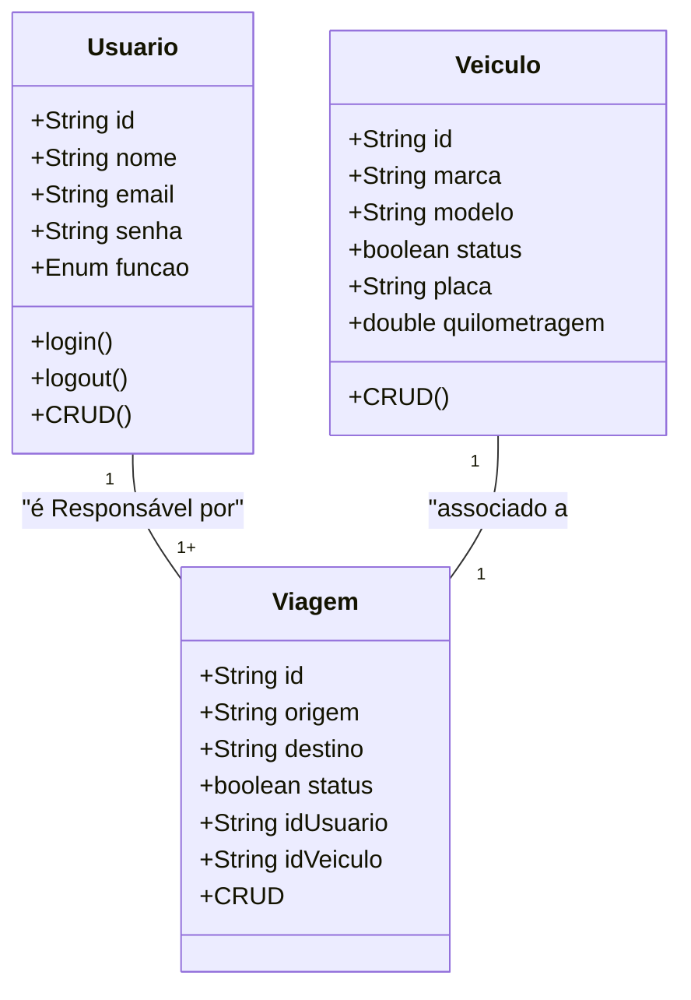
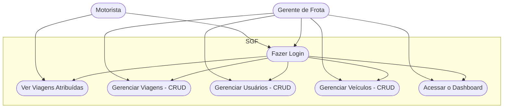
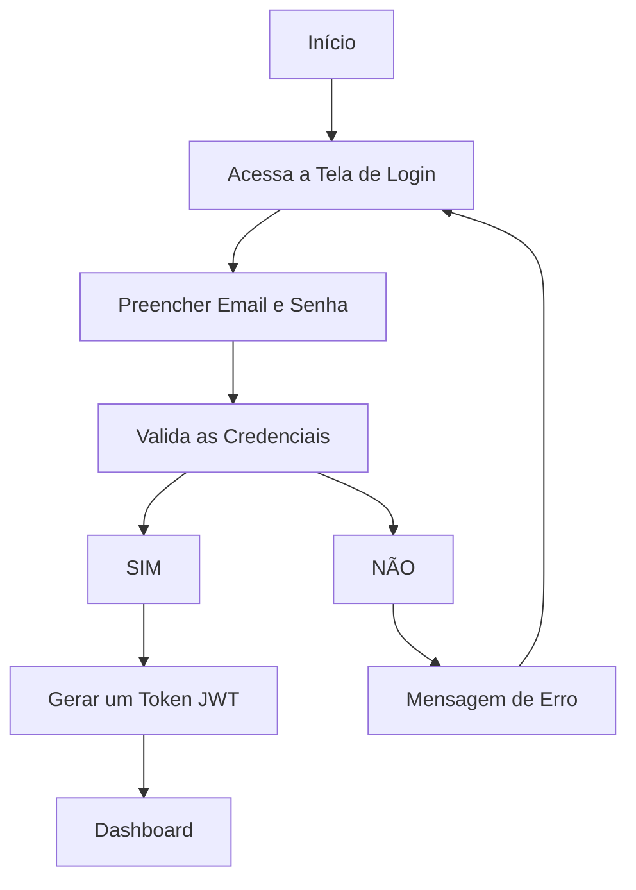

# Sistema de Gestão de Frotas (SGF) - Somativa

## Briefing
O projeto consiste no desenvolvimento de um Sistema de Gestão de Frotas (SGF) no formato de uma aplicação web. O objetivo é otimizar o controle das atividades de veículos e motoristas de uma empresa. A plataforma permitirá o cadastro de motoristas, veículos, e agendar viagens para o motorista e o veículo.

## Objetivo do Projeto
- Gerenciar informações sobre motoristas e veículos da empresa
- Agendar viagens com a origem, o destino e o status (Agendada, Em Curso, Finalizada)
- Dashboard de histórico de viagens
- Proteger acesso aos dados do sistema (criptografia e autenticação)

## Público-Alvo
- Gestor de Frota: Cadastra veículos e motoristas, associa viagens a eles.
- Motorista: Visualiza apenas as viagens que foram atribuídas a ele.

## Levantamento de Requisitos do Projeto

- ### Requisitos Funcionais

- O sistema deve permitir que usuários façam login e logout
- O sistema deve diferenciar as permissões entre Gestor de Frota e Motorista
- O Gestor de Frota deve poder cadastrar, visualizar, editar e remover usuários (motoristas e outros gestores)
- O Gestor de Frota deve poder cadastrar, visualizar, editar e remover veículos da frota.
- O Gestor de Frota deve poder agendar, visualizar, editar e cancelar viagens, associando veículos e motoristas
- O Motorista deve poder visualizar uma lista contendo apenas as suas viagens atribuídas
- O Motorista deve poder alterar o status de suas viagens para "Em Curso" e "Finalizada"
- O Gestor de Frota deve ter acesso a um Dashboard com o histórico e indicadores das viagens

- ### Requisitos Não Funcionais

- As senhas dos usuários devem ser armazenadas de forma criptografada no banco de dados
- A autenticação dos usuários será gerenciada por Token (JWT).
- A interface do sistema deve ser simples, clara e intuitiva para o usuário
- As páginas e consultas principais do sistema devem carregar de forma rápida
- A aplicação deve ser compatível com as versões mais recentes dos principais navegadores
- O código-fonte deve ser limpo, bem documentado e de fácil manutenção

## Recursos do Projeto

- ### Tecnológicos
    - Framework de Desenvolvimento Next/React
    - Linguagem de Programação: TypeScript
    - Banco de Dados: Não Relacional (MongoDB)
    - GitHub
    - VSCode
    - Figma

- ### Pessoal
    - Eu

## Análise de Risco
- Risco de Segurança: Possibilidade de acesso não autorizado ou vazamento de dados.
    - Mitigação: Implementar boas práticas de segurança, como criptografia de senhas, uso de HTTPS e validação de dados de entrada.

- Risco de Perda de Dados: Falha no servidor ou no banco de dados que resulte na perda de informações.
    - Mitigação: Configurar uma rotina de backups automáticos e regulares do banco de dados.

- Risco de Atraso no Cronograma: O desenvolvimento pode levar mais tempo que o planejado.
    - Mitigação: Definir um escopo claro para a primeira versão (MVP) e focar em entregar as funcionalidades essenciais primeiro.

- Risco de Dependência: Por ser um projeto de uma única pessoa, o andamento depende totalmente de um único desenvolvedor.
    - Mitigação: Manter a documentação sempre atualizada e o código organizado para facilitar a compreensão futura ou a colaboração.

## Diagramas

1. ### Classe
- Usuario (Usuario)
    - Atributos: id, nome, email, senha, função
    - Métodos: create, read, update, delete, login, logout

- Veículo (Veiculo)
    - Atributos: id, marca, modelo, status(Ok, Em Manutenção), placa, quilometragem
    - Métodos: CRUD

- Viagem (Viagem)
    - Atributos: id, origem, destino, status(Agendada, Em Curso, Finalizada), idUsuario, idVeiculo
    - Métodos: CRUD

2. ### Casos de Uso
- Casos de Uso:
    - Motorista: Visualiza apenas as viagens que foram atribuídas a ele.
    - Gerente de Frota: Cadastra veículos e motoristas, associa viagens a eles.

    Fazer o login -> Antes de Qualquer ação

3. ### Fluxo
- Diagrama de fluxo de login
    - O usuário acessa a tela de login
    - Insere as credenciais
    - O sistema verifica as credenciais
        - se sim: gera um JWT (Token) => DashBoard
        - se não: manda uma mensagem de erro - permanece na tela de Login

## Protótipos
https://www.figma.com/design/mtyDxt1cI5tr4D9RFUyC1m/Untitled?node-id=0-1&t=6eoZT7DCJt9ZAXdK-1

## Codificação